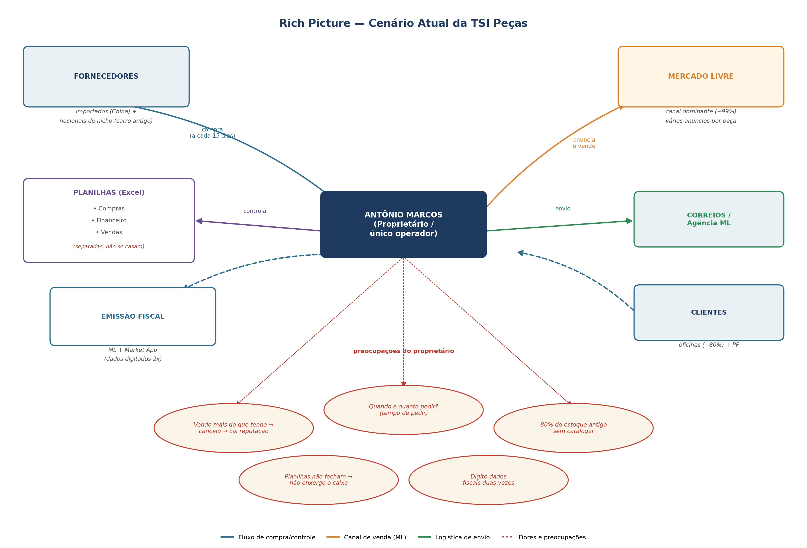
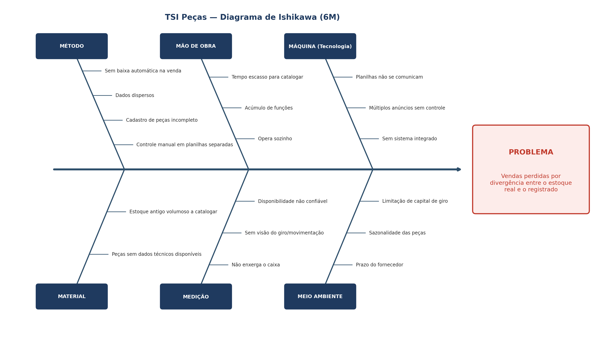

# Cenário, problema e desafios

## 1 Cenário atual do cliente e do negócio

### 1.3 Rich Picture

O Rich Picture apresenta o cenário atual da TSI Peças: o proprietário e único operador, Antônio Marcos, no centro da operação, cercado pelos fornecedores, pelos canais de venda (com forte predominância do Mercado Livre), pela logística de envio (Correios), pelas planilhas de controle e pela emissão fiscal. O diagrama também evidencia as principais preocupações do proprietário, decorrentes do controle manual e fragmentado da operação.

*Figura 1 — Cenário atual da TSI Peças. Imagem extraída do documento de Visão do Produto e Projeto; clique para ampliar.*

### 1.4 Identificação da oportunidade ou problema

O problema central da TSI Peças é a perda de vendas por divergência entre o estoque real e o registrado. Esse problema decorre do controle manual e não automatizado do estoque, apoiado em planilhas parciais que não se comunicam com o registro de vendas. Como a baixa de itens não é automática, o estoque registrado diverge com frequência do estoque real.

Essa divergência leva à perda de vendas em duas situações: o cliente procura uma peça que os registros indicam como disponível, mas que já foi vendida; ou uma peça existente deixa de ser vendida porque não consta corretamente nos registros. No Mercado Livre — canal que concentra a quase totalidade das vendas —, essa divergência também gera cancelamentos, o que afeta a reputação da loja.

Além da perda direta de vendas, o modelo atual consome tempo excessivo do proprietário em tarefas operacionais repetitivas, como o cadastro de peças e a consulta ao estoque. Como ele atua sozinho, o tempo gasto nessas rotinas reduz sua disponibilidade para o atendimento e a gestão do negócio.

#### Indicadores do problema

Os indicadores a seguir, levantados junto ao proprietário, dimensionam o problema e sustentam a necessidade da solução:

| Indicador | Situação atual |
| --- | --- |
| Tempo para consultar a disponibilidade de uma peça | Até 1 hora |
| Tempo para cadastrar uma peça | 5 a 10 minutos |
| Peças cadastradas / em estoque | Aproximadamente 550 |
| Estoque antigo ainda não catalogado | Cerca de 80% |
| Frequência de divergência de estoque | 1 a 2 vezes por mês |
| Valor médio da venda perdida por divergência | Cerca de R$ 90,00 |
| Concentração das vendas por canal | ~99% no Mercado Livre; balcão e contato direto ocasionais |

Esses números evidenciam que o maior impacto do problema está na **eficiência operacional** — sobretudo no tempo elevado de consulta e de cadastro — e na **forte concentração das vendas no Mercado Livre**, canal em que a divergência de estoque gera cancelamentos e afeta a reputação da loja.

#### Análise de causas

O diagrama de Ishikawa organiza as causas do problema segundo os **6M**: Método, Mão de obra, Máquina, Material, Medição e Meio ambiente.

*Figura 2 — Diagrama de Ishikawa da TSI Peças. Imagem extraída do documento de Visão do Produto e Projeto; clique para ampliar.*

### 1.5 Desafios do projeto

#### Desafios técnicos

O principal desafio técnico está na modelagem do cadastro de peças automotivas, que envolve um catálogo extenso, com códigos de fabricante e informações de aplicação por veículo. Estruturar esse cadastro de forma organizada e consultável é essencial para que o controle de estoque seja confiável.

Também é necessário substituir o controle atual em planilhas sem perda de informações, garantindo que os registros de entradas, saídas e baixas nas vendas reflitam a realidade do estoque. Essa substituição exige, ainda, a carga inicial dos dados hoje mantidos em planilhas.

#### Desafio de hardware

O projeto prevê, como etapa futura, a utilização de um leitor de código de barras para agilizar o cadastro e a movimentação das peças. Segundo o proprietário, essa utilização é viável, mas depende da conclusão de etapas anteriores: organização do estoque em planilhas, codificação dos itens, construção do sistema, cadastro dos produtos e impressão de etiquetas.

A aquisição do equipamento representa um custo adicional. Por envolver um dispositivo físico e sua integração ao sistema, o leitor é tratado como um desafio previsto, mas **fora do escopo do produto mínimo viável (MVP)**.

#### Emissão fiscal

Atualmente, a emissão de notas é feita manualmente e em mais de um sistema, com redigitação de dados. A automação completa da emissão fiscal envolve regras específicas (por exemplo, obrigações legais e integração com sistemas externos) que extrapolam o núcleo do problema. Por isso, a emissão fiscal totalmente automatizada é tratada como **evolução futura**, fora do escopo do MVP, podendo o produto, na fase atual, apenas apoiar a atividade a partir do reaproveitamento dos dados já cadastrados.

#### Desafios operacionais

Como o proprietário opera a loja sozinho e concentra várias funções, a solução precisa ser simples e rápida de usar, sem competir com o atendimento nem sobrecarregá-lo.

Também há um desafio de adoção: o conhecimento do proprietário sobre o controle manual favorece a transição, mas a ferramenta precisa oferecer um ganho claro em relação às planilhas atuais para que seu uso se sustente.

#### Desafio de prazo e escopo

O MVP deve ser viável para entrega até o fim do semestre letivo. Isso exige manter o foco no núcleo da solução — o controle interno de estoque — e tratar funcionalidades de maior complexidade, como o leitor de código de barras e a integração automática com o Mercado Livre, como evoluções futuras.

Delimitar esse escopo é, por si só, um desafio de priorização.

## Versionamento

| Versão | Data | Descrição | Autor(es/as) |
| :----: | :--: | --- | --- |
| 1.0 | 04/09/2026 | Iniciação do documento | [Thiago Gomes](https://github.com/thgomxs) |
| 1.1 | 07/09/2026 | Preenchimento dos itens 1.3 a 1.5, inclusão dos diagramas e revisão textual | [João Melo](https://github.com/jot4-ge) |
| 1.2 | 18/09/2026 | Correções da issue #3: novo Rich Picture, Ishikawa reclassificado, indicadores do problema, declaração do problema revisada e emissão fiscal declarada fora do escopo | [João Melo](https://github.com/jot4-ge) |