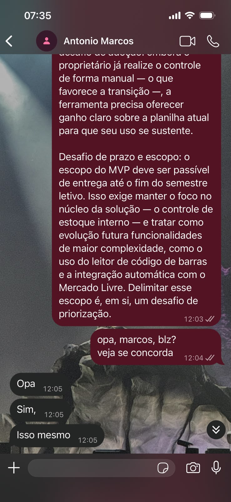

# Cliente e negócio

## 1 Cenário atual do cliente e do negócio

### 1.1 Identificação do cliente/parceiro

| Informação | Descrição |
| --- | --- |
| Nome | TSI Peças |
| Tipo | Cliente real: microempresa do ramo de autopeças, dedicada ao comércio varejista de peças automotivas. |
| Representante | Antônio Marcos, proprietário e único operador da loja. |
| Forma de contato | Encontros presenciais com o proprietário e comunicação por WhatsApp. |
| Vínculo com o projeto | Principal stakeholder e usuário administrador. Procurou a equipe relatando a necessidade da ferramenta; participa da validação dos requisitos e da homologação das entregas. |

### 1.2 Introdução ao negócio e contexto

A TSI Peças é uma microempresa do ramo de autopeças que atua no comércio varejista de peças automotivas. O negócio é conduzido integralmente por Antônio Marcos, proprietário e único operador, responsável por todas as etapas da operação: compra, cadastro, venda e controle de estoque.

A empresa comercializa exclusivamente peças de automóveis, sem prestação de serviços, e opera por três canais de venda:

- **Balcão da loja física:** atendimento e venda presencial.
- **Mercado Livre:** comercialização por meio do marketplace.
- **Contato direto com o cliente:** pedidos por telefone ou mensagem, com envio pelos Correios.

O controle da operação é feito manualmente, com apoio de planilhas parciais do Excel, sem automação entre o registro de vendas e a atualização do estoque.

## Validação do cliente

O conteúdo da Visão de Produto e Projeto foi validado pelo cliente, Antônio Marcos, em dois momentos: na revisão dos desafios do projeto e na análise do documento completo, que foi aprovado pelo proprietário.

*Figura — Validação dos desafios do projeto pelo cliente.*

*Figura — Aprovação do documento completo pelo cliente.*

## Versionamento

| Versão | Data | Descrição | Autor(es/as) |
| :----: | :--: | --- | --- |
| 1.0 | 04/09/2026 | Iniciação do documento | [Thiago Gomes](https://github.com/thgomxs) |
| 1.1 | 07/09/2026 | Preenchimento dos itens 1.1 e 1.2 e revisão textual | [João Melo](https://github.com/jot4-ge) |
| 1.2 | 09/09/2026 | Inclusão das evidências de validação do cliente | [João Melo](https://github.com/jot4-ge) |
