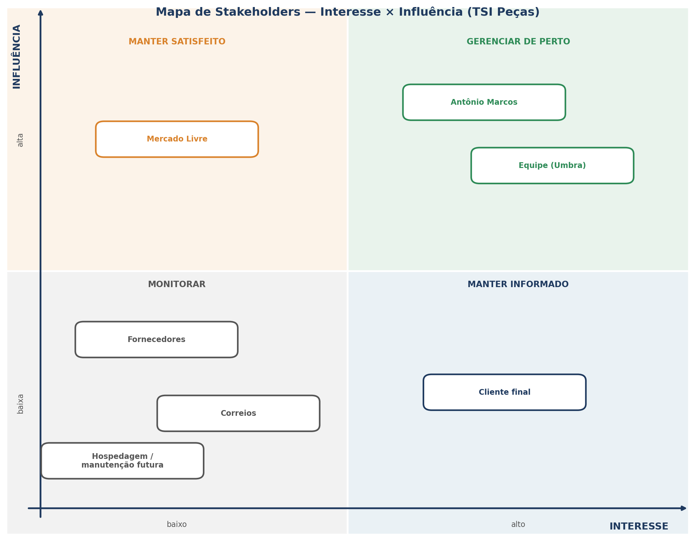

# Stakeholders e segmentação

## 1 Cenário atual do cliente e do negócio

### 1.6 Mapa de stakeholders

Os stakeholders do projeto foram identificados e posicionados segundo seu nível de interesse no projeto e de influência sobre ele. A matriz a seguir orienta a estratégia de participação de cada um.

*Figura — Mapa de stakeholders (interesse × influência).*

O quadro a seguir detalha cada stakeholder, sua relação com a solução, seus interesses e a estratégia de participação adotada.

| Stakeholder | Relação com a solução | Interesse | Influência | Estratégia de participação |
| --- | --- | :---: | :---: | --- |
| Antônio Marcos (proprietário) | Cliente, principal fonte de requisitos, validador e homologador; único usuário do sistema. | Alto | Alta | Gerenciar de perto: envolvê-lo na elicitação, validação e homologação de cada entrega. |
| Equipe de desenvolvimento (Umbra) | Responsável pela construção do produto. | Alto | Alta | Gerenciar de perto: alinhamento contínuo, decisões de escopo e priorização em conjunto. |
| Mercado Livre | Canal que concentra a quase totalidade das vendas; define regras de API, comissões e políticas que condicionam o sistema. | Baixo | Alta | Manter satisfeito: respeitar as regras e limites da plataforma; acompanhar mudanças na API e nas políticas. |
| Cliente final da loja | Beneficiário indireto; não utiliza o sistema, mas é afetado pela precisão do estoque. | Alto | Baixa | Manter informado: garantir que o efeito do sistema (disponibilidade confiável) chegue a ele. |
| Fornecedores | Origem das peças; afetam a reposição e o giro do estoque. | Baixo | Baixa | Monitorar: considerar prazos e condições de fornecimento no planejamento de compras. |
| Correios | Logística de envio das vendas. | Baixo | Baixa | Monitorar: contexto operacional externo, sem interação direta com o sistema. |
| Hospedagem / manutenção futura | Responsáveis pela sustentação do sistema após a entrega. | Baixo | Baixa | Monitorar: prever documentação e requisitos que facilitem a manutenção futura. |

### 1.7 Segmentação de clientes

Por se tratar de uma ferramenta interna da loja, a solução atende a um único perfil de usuário e beneficia indiretamente o cliente final.

#### Perfil primário — Proprietário/administrador

O proprietário é o único operador da TSI Peças e atualmente responde por todo o controle manual do estoque e das vendas. Busca uma ferramenta simples, que padronize o cadastro de peças, automatize o controle de estoque e reduza o tempo gasto em tarefas operacionais. É o único usuário efetivo do sistema.

#### Beneficiário indireto — Cliente final da loja

O cliente final não utiliza o sistema, mas é impactado positivamente por ele. Com o estoque preciso e atualizado, recebe informações de disponibilidade mais confiáveis e corre menor risco de frustração por divergências entre o que é anunciado e o que existe em estoque.

## Versionamento

| Versão | Data | Descrição | Autor(es/as) |
| :----: | :--: | --- | --- |
| 1.0 | 04/09/2026 | Iniciação do documento | [Thiago Gomes](https://github.com/thgomxs) |
| 1.1 | 07/09/2026 | Preenchimento dos itens 1.6 e 1.7 e revisão textual | [João Melo](https://github.com/jot4-ge) |
| 1.2 | 22/09/2026 | Reestruturação do mapa de stakeholders (matriz interesse × influência e estratégias de participação) e inclusão de stakeholders indiretos, conforme issue #3 | [João Melo](https://github.com/jot4-ge) |
